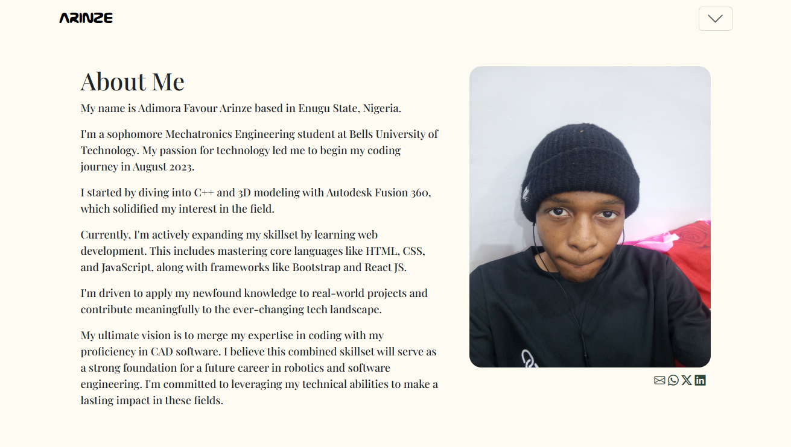

<h2 align="end" style="font-family: Arial,ui-monospace">
  Portfolio Website
</h2>
I'm Adimora Favour Arinze, a Robotics and Mechatronics Engineer with a passion for robots. This website showcases my skills and experience through web development  and arduino. Explore my work to get a sense of my creative process and what I can bring to the table. Let's connect!

## Color Reference

| Color         | Hex                                                              |
|---------------|------------------------------------------------------------------|
| Light Gray    |  #FEFCF2 |
| Dark green    |  #31473A |

<h2 align="end" style="font-family: Arial,ui-monospace">
  Preview
</h2>

  

 

 &nbsp;
 &nbsp;
 &nbsp;

## Built With

My portfolio website <a href="https://thenzevhukwu.vercel.app/" target="_blank">thenzevhukwu.vercel.app</a> features some of my GitHub projects including my resume and some skills 

This project was built using these technologies.

- Bootstrap
- HTML5
- CSS3
- VsCode
- Vercel

## 🛠 Installation and Setup Instructions

1. Installation: `npm install`

2. In the project directory, you can run: `npm start`

Runs the app in the development mode.\
Open [http://localhost:3000](http://localhost:3000) to view it in the browser.
The page will reload if you make edits.
